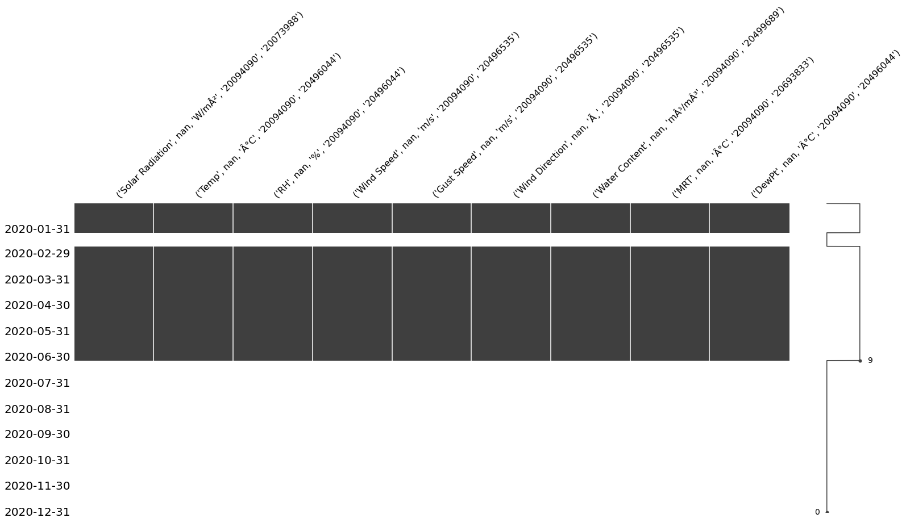
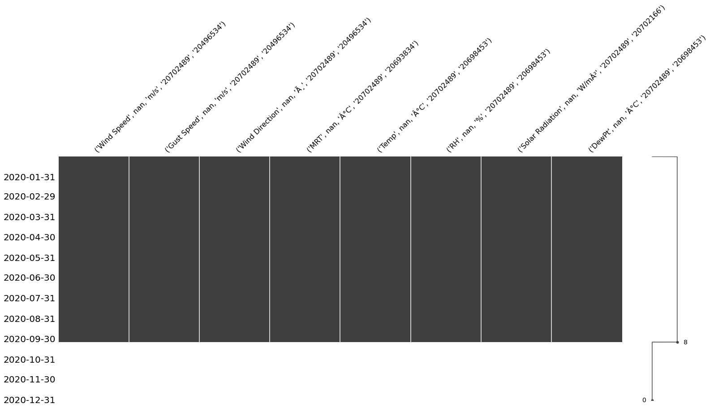

# CampusMicroclimateAndWeather

## Weather stations

- A table with all variables collected per station is [here](https://docs.google.com/spreadsheets/d/1stQ-JpZJQzPA_StJ-Pz5o_tf_n-uWoIriaG0Jw_OWBU/edit?usp=sharing).

- All notes and comments about logging and battery status etc. [is collected here.](https://docs.google.com/spreadsheets/d/1gOeqPoUskun3UhIJ1qPwKxNo8b02dM2avpZNKrtnYA4/edit?usp=sharing)
- Manual categorization into sunny/cloudy days and their wind directions is done [here](https://docs.google.com/spreadsheets/d/1Ovnedzpi4LMOBK0Ii7IPQtpKql-AmFPRoOFP7UN4RUE/edit?usp=sharing).
- Readme on the File Structure of the Google Drive Folder for Campus Weather and MicroClimate is done [here](https://docs.google.com/document/d/1QgseVN3zFGXV9Clwww-3O3Q9E_a1uQgMMkEOYMuYIeE/edit?usp=sharing)

## Map

## Photos of stations

- Photos [are collected here](https://drive.google.com/drive/folders/12eZfdLehY-cCHlcfHygO_kw4nGF1c4Tg?usp=sharing).

## In general

- We use ReadPlot.ipynb for all the scripting and general plotting
- Some helper functions live externally in the remaining *.py files
  - map.py - Create a nicely-looking map of all station in Ithaca
  - plot_wind_rose.py - Create a wind rose plot from wind velocity and wind direction
  - helper-functions.py - Helper functions for unit conversion and hour-to-date conversion
  - export_for_validation.py - Export individual variables to load them into Grasshopper

## Process

1. Offload data from stations, in the .dtf format
2. export from hoboware in .csv, and make sure all the datetime settings are correct
3. open the csv, change the index so it starts at the next number we are adding to from the previous file (so not #1, #15,000 or whatever it is)
4. format the time correctly so that hoboreader python script can read it
5. Copy the new data into the master data file for that station (where we merge all the readouts), must be done in .xlsx file format so that excel does not mess up all the formatting
6. Save this new file as .csv in the github folder
7. Sync Github
8. re-run the python script, and almost always it complains about something, troubleshoot.

## Known Issues

1. Hoboreader will not plot for the date unless all sources have data for that date. For instance, if 4 of your sources have data 1/1 - 6/1, and 1 has it 1/1 - 7/1, it will only plot until 6/1, right now.

---

# Analysis

### General analysis cloudy/sunny

Sunny Day: (Radiation)

.png)

Cloudy Day: (Radiation)

Temperature:.png)

Notice on the sunny day, the two stations most exposed (PSB Parking Lot and Milstein Roof) jump much higher than the rest, which are predominantly shaded (Garden, and even Olin Roof which gets a fair amount of shadow from Olin Library, esp in winter as the sun is more southerly). The cloudy day provides much more uniform measurements, as expected, as everything is "shaded" in that aspect. Obviously the stations under shaded conditions are still lower, but the gap is much less. 

Sunny:

.png)

We see the same drastic jump in the most exposed stations on the unshielded sensor - pretty incredible jump from mid 40s °F (5-10C) to around 80F (26C) by the afternoon, while the shaded sensors (even on the exposed stations) remain in the upper 40s to low 50s F (official temp that day at ITH was 52°F). While the Radiation is likely a good contributor to this, the effects of the concrete buildings, large amount of Blacktop paving for the PSB parking lot, and the gravel/dirt roof w/ effects from the new reflective soffit on the FAL reflecting the sun over the Milstein Roof likely had a huge effect as well. We can see the shaded stations, even when not shielded from radiation, were much more consistent and reasonable in temperature. From a building perspective, in the PSB parking lot, that curtain wall glass walkway that runs along the parking lot gets noticeably warm, even when it was in the 30s outside, just from the sun. I am not an expert on the thermal properties of concrete, but the southerly sun faces directly the wall our station points to (to the north) at PSB, only 5-10ft away. I wonder if the heat soaked up by the concrete wall can radiate out, and also effect the station? i.e., if we moved the station back 50' to the center of the parking lot, would it get as high? Only change it would have is that it is farther from the building. It would be just as unshaded/ unprotected.

Cloudy:

.png)

Here on the cloudy day, we can see all stations are reasonably w/in range of each other. heating/cooling costs likely much lower on these days as the systems are not playing catch up to the effects of solar radiation, temp, etc. Also why it cannot get as cold at night, or as warm during the day - the clouds prevent radiational cooling/warming. Much more temperate.

### Eddy3D Blog Post 

For the purposes of validating simulations conducted with Eddy, a tool developed by the ESL to simulate airflow and microclimates for wind and outdoor comfort design; a series of weather stations were built and placed around Cornell University’s Ithaca campus to measure, in real time, a series of different sensible weather variables including radiation, wind speed and direction, temperature and relative humidity that could then be compared with the outputs from the Eddy model for the same areas of the campus.

The stations were all built using Hoboware components, on steel tripods and placed in strategic locations that had pre-disposed microclimate tendencies. Some custom components such as arms and sensor holders were made (see image) One station was placed on the roof deck of Olin Library, which given the nature of the deck (steel construction with a gravel layer) has no evaporation and no vegetation shading; One station in the Physical Science Building’s Parking Lot which also has no evaporation, but has the effect of surrounding buildings on wind/radiation and temperature; One station in the Stone Garden between Tjaden and Sibley Hall which has effects from evaporation, shading from vegetation and the venturi effect. The fourth and last station was placed on Milstein Roof which has a green roof, thus impacts from evaporation, but no shading from vegetation.

The stations were run continuously, and data downloaded every couple of weeks to check the validity of the data, and to see if the assumptions of the effects from their placement was correct. The data from the stations will continue be used in analysis to validate the Eddy model and improve its simulations!

# Missing Values

# Missing Values

DL1_Stone_Garden_Tjaden_Hall_2020_MissingVals

DL5_Game_Farm_Road_2019_MissingVals

DL4_Milstein_Hall_Roof_2019_MissingVals

DL3_Olin_Library_2019_MissingVals

DL2_PSB_Parking_Lot_2019_MissingVals

DL1_Stone_Garden_Tjaden_Hall_2019_MissingVals

DL5_Game_Farm_Road_2020_MissingVals

DL4_Milstein_Hall_Roof_2020_MissingVals

DL3_Olin_Library_2020_MissingVals

DL2_PSB_Parking_Lot_2020_MissingVals
